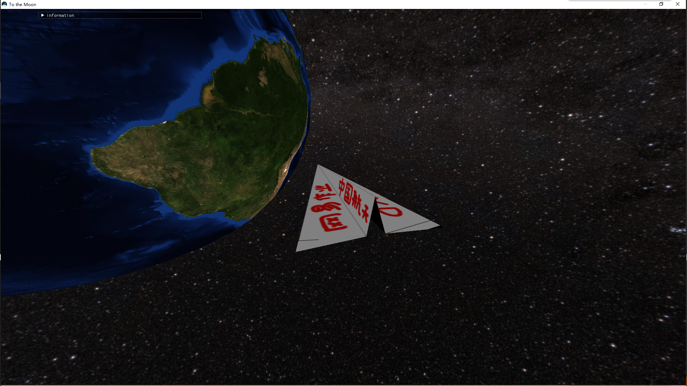

# [To the Moon] sample introduction

## Source Code

### Architecture

### Modules

#### Graphics

Graphics API use the DirectX11 to implement,  package some common interfaces like DeviceContext, SwapChain, VertexBuffer, PixelBuffer, IndexBuffer etc.

Use the **RenderSystem** class to organize all implements and provide an API like CreateXXX for dynamically generating related classes. 

The main function of the **Material** class is to compile and apply VertxShader and PixelShader to the game, support multiple Texture resources, and support updating ConstantBuffer and setting CullMode.

#### InputSystem

The input system mainly uses the Keyboard and Mouse codes in [DirectXTK](https://github.com/microsoft/DirectXTK), and the **IInputListener** interface is used to implement multi-window input. The **IInputListener** interface The function is as follows:

#### Math

The math library is mainly composed of data structures commonly used in 3D mathematics, including the following structures:

- Matrix4x4 - 4x4 matrix (MVP matrix, inverse, get orientation, etc.)

- Vector2/Vector3/Vector4 - 2/3/4 dimensional vector (float)

- Point - screen coordinate point (int x, int y)

- MeshVertex - mesh vertices (position, texcoord, normal) for ConstantBuffer

- EulerAngle - Euler angle (contains 4x4 matrix for calculating rotation)

#### Resource

Resource mainly includes Mesh and Texture resources

#### Plugins

The plugin used, contains the following sections:

- [tinyobjloader](https://github.com/tinyobjloader/tinyobjloader) - A lightweight open source obj file parser

- [Dear ImGui](https://github.com/ocornut/imgui) - Bloat-free Graphical User interface for C++ with minimal dependencies

#### Packages

This project uses two external packages, namely [DirectXTex](https://github.com/microsoft/DirectXTex) and [DirectXTK](https://github.com/microsoft/DirectXTK), where Tex is used for textures Loading, TK is used for Keyboard&Mouse input.

## 游戏说明

The runnable game contains the exe file and the Assets folder, where the Mesh, Shader and Texture resources are stored in the Assets.

The game implements a basic Earth-Moon system. Players can control the spacecraft to move in Earth orbit, lunar orbit and Earth-Moon transfer orbit. The orbit diagram is as follows:

The transfer orbit requires the spacecraft to fly to the earth-moon transfer point/moon-earth transfer point to change the orbit. When the player presses the **space** button, the spacecraft will automatically change the orbit when it can be transferred.

### Instructions

- F1 : open/close operation instructions

- F11: enable/disable full screen

- F: enable/disable fps camera movement

- V: turn on/off all camera rotation view

- ESC: on/off move and view

- Mouse movement: view

- Numpad 1: switch to first-person camera

- Numpad 1: toggles the third-person camera

- Scroll wheel: 3rd person camera distance adjustment

- w/a/s/d: forward/left/backward/right

- space: switch track

### Others

The game UI supports real-time adjustment of relevant game states. The approximate parameters are as follows:

### Summarize

This Demo implements a basic Earth-Moon scene, in which the Earth and Moon have rotation effects, skyboxes, spacecraft orbits, first-person and third-person cameras, and all objects in the scene have textures and lighting (parallel light) effects.

### Screenshot

Earth Oribit

To the moon

Moon Orbit

Back to earth

